**Report**

**Dataset Description**

The maximum counts of the dataset of class were 900 images and rest of
starts from 200 to 700. Therefore, there is an imbalance in the dataset.
We applied image augmentation techniques such as flipping and rotating
(90°, 180°, 270°). With these augmentation techniques, each class now
has 900 pictures.

**Train, Test, Validation:**

1.  **Validation 20% data**

2.  **Train 80%**

3.  **Test data was separate.**

**Classes:**

-   bbps-0-1 - 0

-   bbps-2-3 - 1

-   cecum - 2

-   dyed-lifted-polyps - 3

-   dyed-resection-margins - 4

-   esophagitis - 5

-   impacted-stool - 6

-   normal-z-line - 7

-   polyps - 8

-   retroflex-rectum - 9

-   ulcerative-colitis -- 10

> All models other than VGG 16 used following layers:

1.  Flatten

2.  Dense with 128 units

**Hyperparameters:**

-   RMSprop(learning_rate=1e-5)

-   Epochs 10

**Best Model:**

VGG -- 16

# Model Performance

| **Model**      | **Accuracy** (Train) | **Accuracy** (Validation) | **Accuracy** (Test) | **Loss** (Train) | **Loss** (Validation) | **Loss** (Test) |
|----------------|----------------------|---------------------------|---------------------|------------------|-----------------------|-----------------|
| VGG-16         | 97%                  | 96.34%                    | 89.84%              | 0.10             | 0.12                  | 0.29            |
| VGG-19         | 97%                  | 92%                       | 89.95%              | 0.19             | 0.10                  | 0.32            |
| DenseNet121    | 99.7%                | 97%                       | 88.98%              | 0.03             | 0.08                  | 0.32            |

**Augmentation:**

**Simple**            **Augmented**                   Simple                           Augmented**

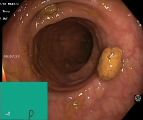

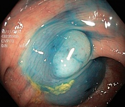

**VGG-16**

**Fine Tuning**

We applied the VGG-16 model and fine-tuned the last block 5, achieving
an accuracy of 97% on the training set. However, the validation accuracy
was only 70%, indicating overfitting. There was a significant difference
in loss, approximately 25% to 29%.

To mitigate overfitting, we added a dense layer with 128 neurons,
applied a dropout of 0.2, and included batch normalization. This
adjustment led to an improved performance with a training accuracy of
97% and validation accuracy of 96%. The loss values ranged between 0.25
to 0.30.

**layers:**

1.  Flatten

2.  Dense with 128 units

3.  Dropout 0.2

4.  Batch Normalization

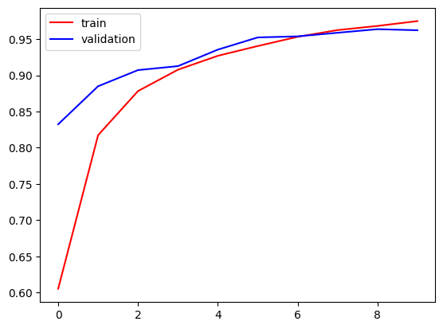
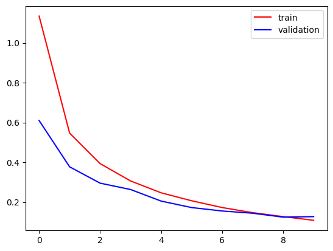

**Test Accuracy Confusion Matrix and Classification report:**

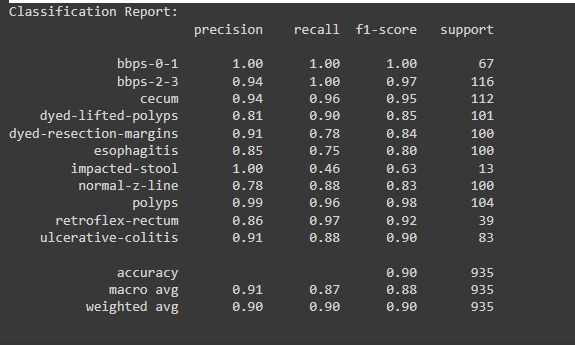
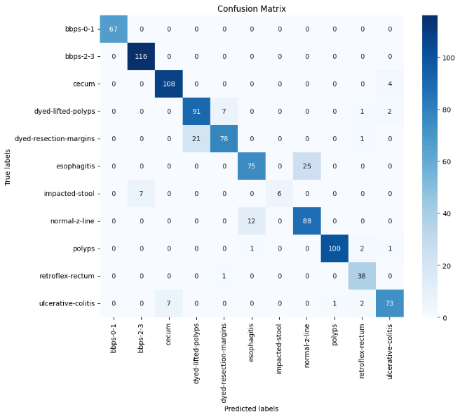

**VGG -- 19:**

**Removed dropout and batch normalization layer.**

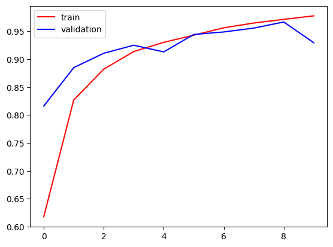
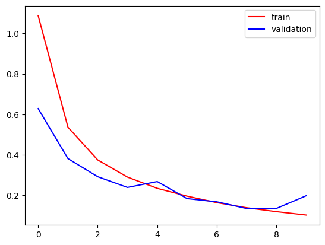

**Test Accuracy Confusion Matrix and Classification report:**

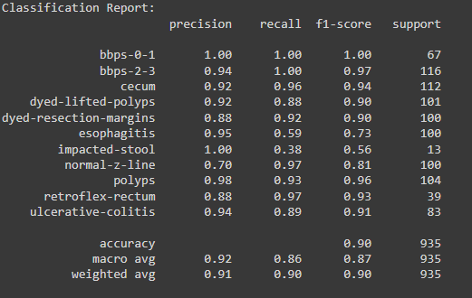
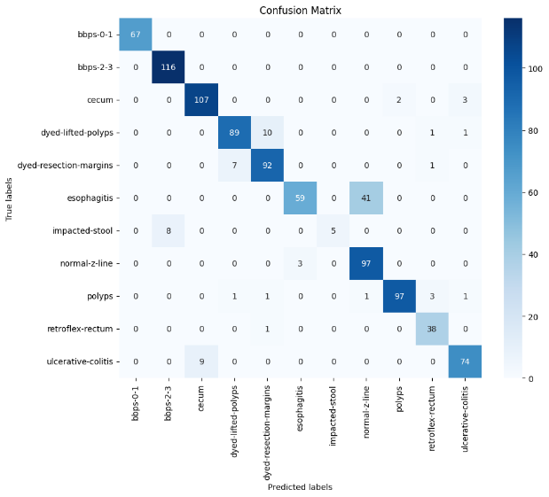

**DenseNet121**

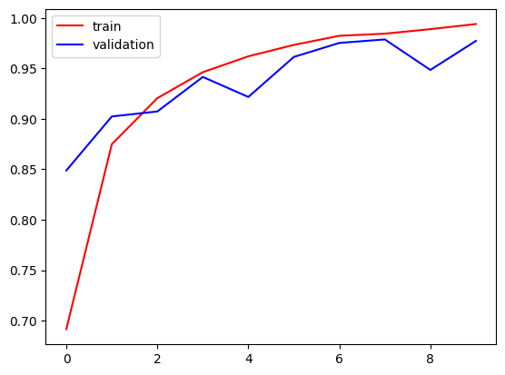
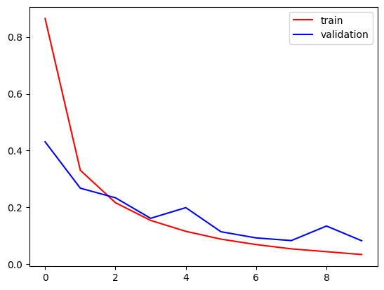

**Test Accuracy Confusion Matrix and Classification report:**

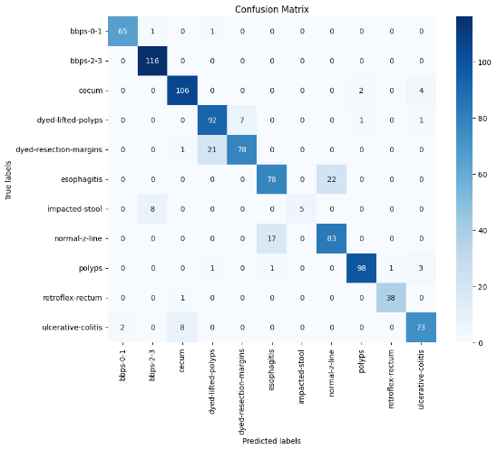
